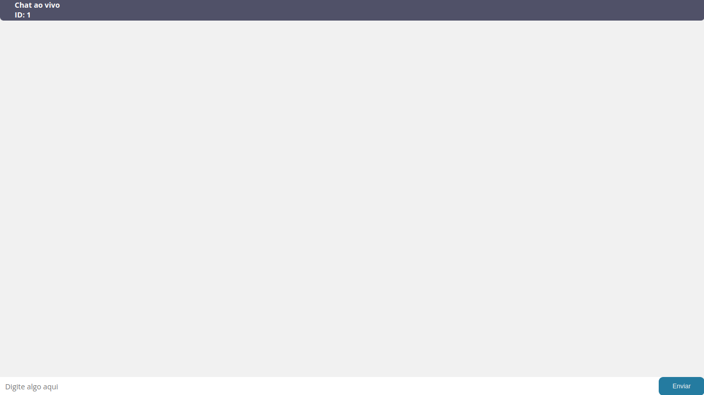
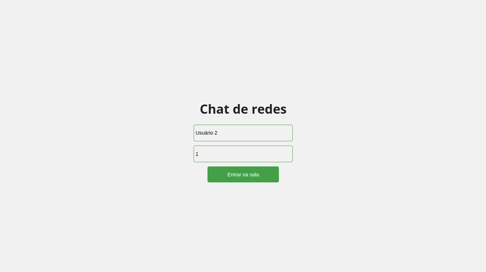
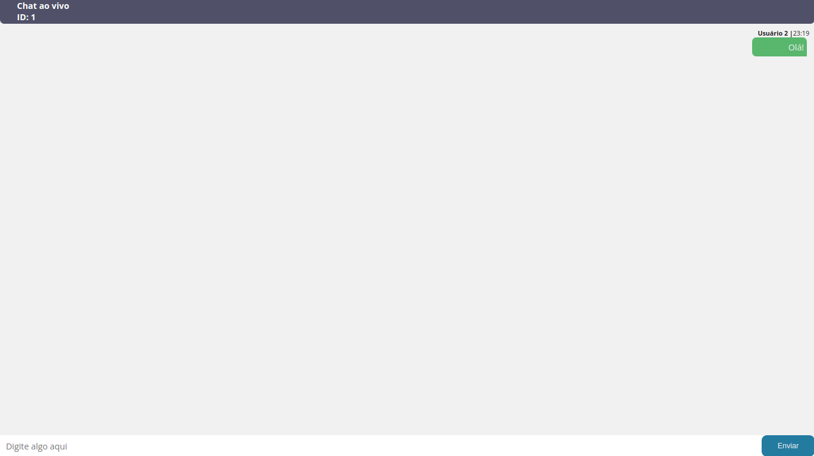
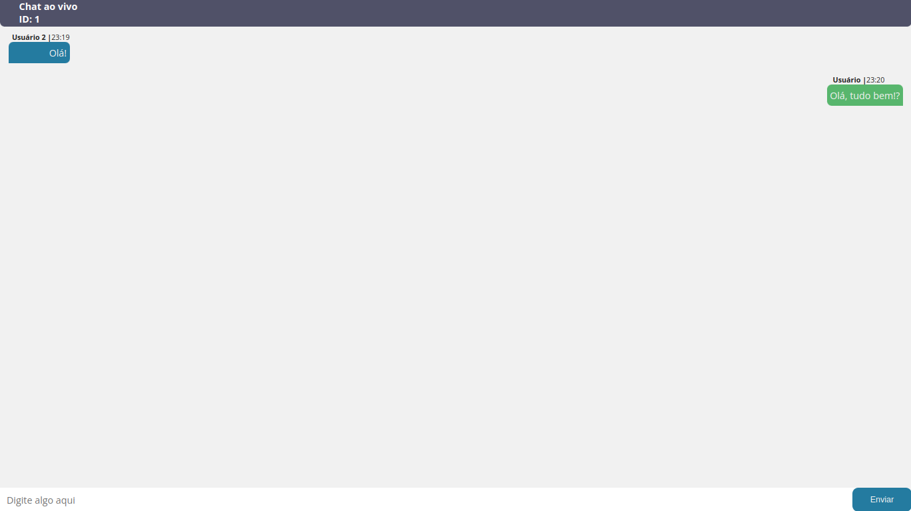
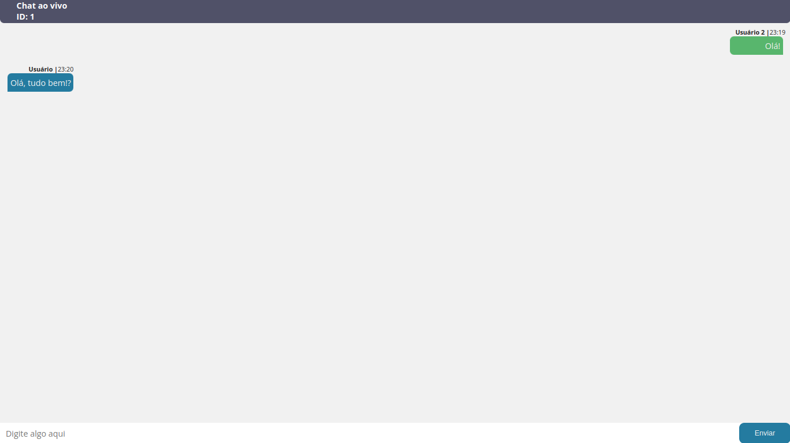

# Trabalho de Redes II - Chat de mensagens

Este trabalho visa mostrar de forma prática a implementação e o funcionamento de uma aplicação para troca de mensagens instantâneas utilizando o protocolo WebSocket (RFC 6455). Utilizamos um modelo cliente-servidor, onde os vários clientes da aplicação comunicam-se entre si intermediados por um servidor central, que gerencia o fluxo de mensagens entre diferentes salas. Executando sobre o Node.js, a aplicação atua como um servidor HTTP e um servidor WebSocket simultaneamente, utilizando para esta tarefa o módulo HTTP padrão do Node.js e o módulo Socket.IO server-side. Em conjunto com esses dois módulos, a aplicação utiliza o Express para servir a interface do cliente, desenvolvida em React e utilizando o módulo Socket.IO client-side para conectar-se ao servidor WebSocket.

# Como executar localmente

## Pré-requisitos

A implementação do trabalho foi realizada através do Node.js, utilizando bibliotecas tanto no lado do cliente quanto do servidor. Para execução do trabalho, é necessária a instalação dos seguintes pré-requisitos base:

- `Node.js`
- `npm`
- `Wireshark`

**Observação:** todas as três aplicações listadas acima são multiplataforma, estando disponíveis para diversos sistemas operacionais e arquiteturas.

## Clonagem
### Pelo GitHub
No repositório do projeto no GitHub, seleciona o botão "Code" (em verde) e então o botão "Download ZIP". Descompacte o arquivo ZIP com o diretório do projeto.
### Pelo git
Clone o repositório do projeto através do comando abaixo:
```bash
git clone https://github.com/pksasso/redesIITrab.git
```

## Instalação das dependências
Instale as dependências do projeto através do npm utilizando o seguintes comandos abaixo tanto no diretório `frontend` quanto no `backend`:
```bash
npm install
```
## Build e Execução
Com as dependências já instaladas para ambos os diretórios, execute o comando abaixo no diretório `frontend` para gerar a aplicação do lado do cliente:
```bash
npm run build
```
Em seguida, execute o comando abaixo no diretório `backend` para inicializar o servidor e servir a aplicação localmente:
```bash
npm run start
```
Caso o servidor seja inicializado com sucesso, a mensagem de saída será:
```bash
> redes2trab@1.0.0 start
> node src/index.js

Servidor HTTP executando na porta 3001
```

## Teste

### Passo 1

Abra o navegador do seu sistema e prossiga para o endereço `http://localhost:3001` a fim de executar a aplicação. Uma tela inicial com a mensagem "Chat de Redes" deverá ser exibida junto aos campos para preenchimento do nome de usuário e o ID da sala.

<p align="center"></p>

Observe a saída do processo do servidor em execução; a mensagem "Novo usuário conectado: `<ID>`" deverá ser exibida:
```bash
Novo usuário conectado: mfiVqMWHQeppCz1RAAAB
```

<hr/>

### Passo 2

Insira o nome do seu usuário e o ID da sala, e então acione o botão "Entrar na sala" (em verde). Você deverá ser levado a tela do chat. 

<p align="center"></p>

Observe a saída do processo do servidor em execução; a mensagem "Usuário com o ID: `<ID>` conectou-se à sala: `<ID DA SALA>`" deverá ser exibida:
```bash
Usuário com o ID: mfiVqMWHQeppCz1RAAAB conectou-se à sala: 1
```

<hr/>

### Passo 3

Em uma nova aba do seu navegador, dirija-se ao mesmo endereço, e repita o processo anterior inserindo um nome de usuário diferente. Mantenha o mesmo ID da sala.

<p align="center"></p>

Observe a saída do processo do servidor em execução:
```bash
Novo usuário conectado: VDrnkQPvPOEo3xW9AAAD
Usuário com o ID: VDrnkQPvPOEo3xW9AAAD conectou-se à sala: 1
```

<hr/>

### Passo 4

Para iniciar a troca de mensagens, insira a mensagem a ser enviada e pressione a tecla `ENTER`. Observe as mensagens sendo enviadas e recebidas através de ambas as abas.

<p align="center"></p>
<p align="center"></p>
<p align="center"></p>

<hr/>

### Passo 5

Para desconectar-se da aplicação, basta fechar a respectiva aba. Observe que a saída do processo do servidor em execução registrará o encerramento da conexão.

```bash
Usuário com o ID: VDrnkQPvPOEo3xW9AAAD desconectado
Usuário com o ID: mfiVqMWHQeppCz1RAAAB desconectado
```

Para finalizar o processo do servidor, pressione simultaneamente as teclas `CTRL` e `C`.

## Autoria
Arthur Abreu, Brendo Costa, Patrick Sasso

Aplicação desenvolvida para a disciplina TCC00228 - Redes de Computadores II para Sistemas de Informação - Turma A1 - 2022.1 - ministrada pelo Professor Flavio Luiz Seixas.

